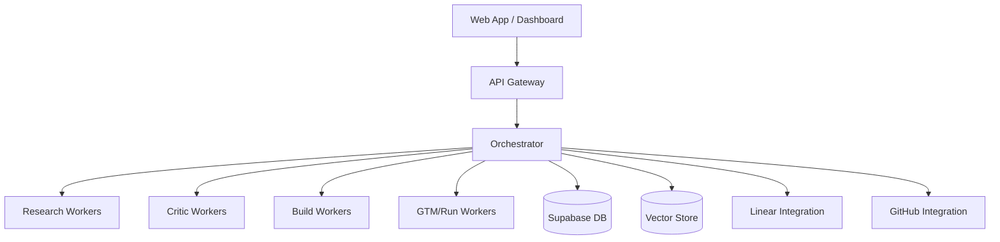

```mermaid
flowchart TD
    WA[Web App / Dashboard]
    AP[API Gateway]
    OR[Orchestrator]
    RW[Research Workers]
    CW[Critic Workers]
    BW[Build Workers]
    GW[GTM/Run Workers]
    DB[(Supabase DB)]
    VS[(Vector Store)]
    LI[Linear Integration]
    GI[GitHub Integration]

    WA --> AP
    AP --> OR
    OR --> RW
    OR --> CW
    OR --> BW
    OR --> GW
    OR --> DB
    OR --> VS
    OR --> LI
    OR --> GI
```
