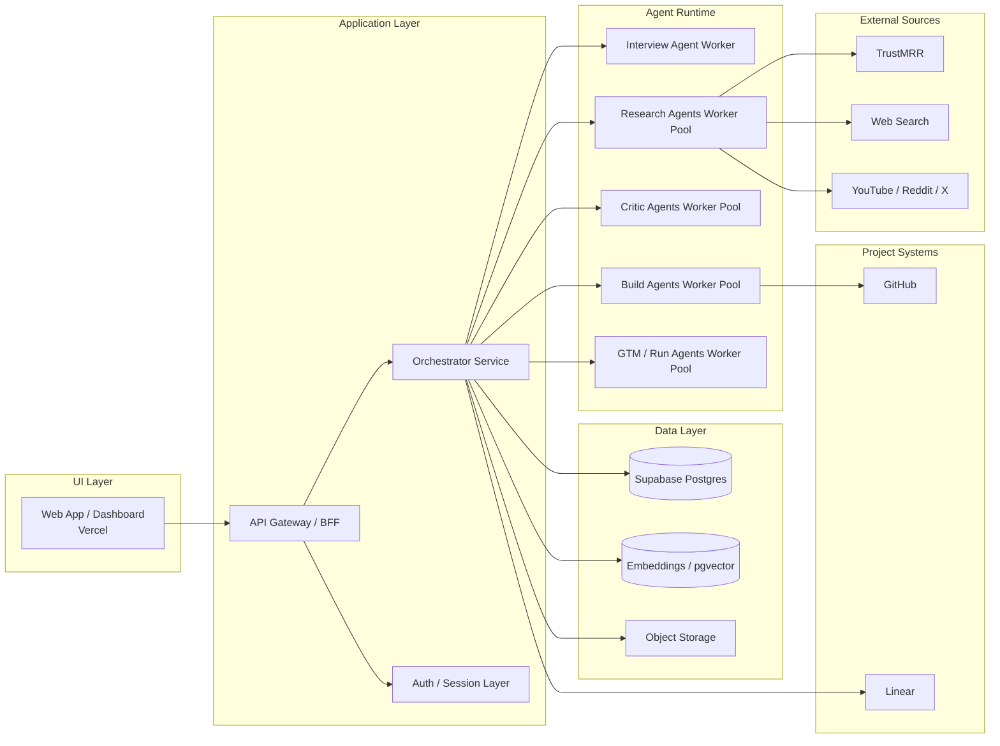

```mermaid
flowchart LR
    subgraph UI[UI Layer]
        A1[Web App / Dashboard<br/>Vercel]
    end

    subgraph API[Application Layer]
        B1[API Gateway / BFF]
        B2[Orchestrator Service]
        B3[Auth / Session Layer]
    end

    subgraph AGENTS[Agent Runtime]
        C1[Interview Agent Worker]
        C2[Research Agents Worker Pool]
        C3[Critic Agents Worker Pool]
        C4[Build Agents Worker Pool]
        C5[GTM / Run Agents Worker Pool]
    end

    subgraph DATA[Data Layer]
        D1[(Supabase Postgres)]
        D2[(Embeddings / pgvector)]
        D3[Object Storage]
    end

    subgraph PM[Project Systems]
        E1[Linear]
        E2[GitHub]
    end

    subgraph EXT[External Sources]
        F1[TrustMRR]
        F2[Web Search]
        F3[YouTube / Reddit / X]
    end

    A1 --> B1
    B1 --> B2
    B1 --> B3

    B2 --> C1
    B2 --> C2
    B2 --> C3
    B2 --> C4
    B2 --> C5

    B2 --> D1
    B2 --> D2
    B2 --> D3

    B2 --> E1
    C4 --> E2

    C2 --> F1
    C2 --> F2
    C2 --> F3
```
