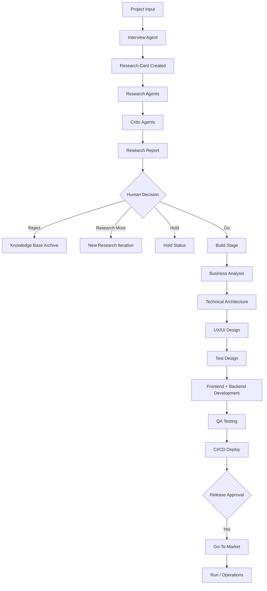

```mermaid
flowchart TD

A[Project Input] --> B[Interview Agent]

B --> C[Research Card Created]

C --> D[Research Agents]

D --> E[Critic Agents]

E --> F[Research Report]

F --> G{Human Decision}

G -->|Reject| H[Knowledge Base Archive]

G -->|Research More| I[New Research Iteration]

G -->|Hold| J[Hold Status]

G -->|Go| K[Build Stage]

K --> L[Business Analysis]

L --> M[Technical Architecture]

M --> N[UX/UI Design]

N --> O[Test Design]

O --> P[Frontend + Backend Development]

P --> Q[QA Testing]

Q --> R[CI/CD Deploy]

R --> S{Release Approval}

S -->|Yes| T[Go-To-Market]

T --> U[Run / Operations]
```
